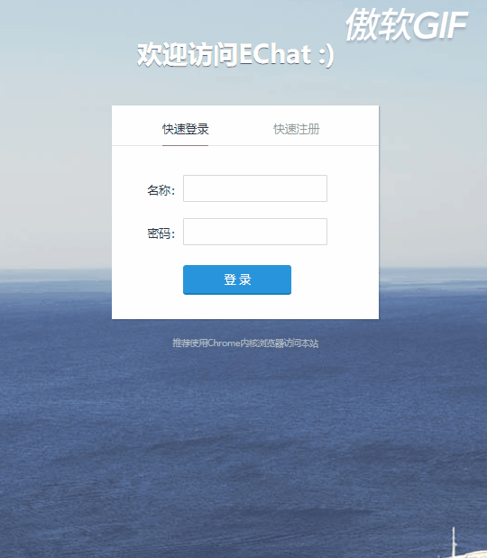
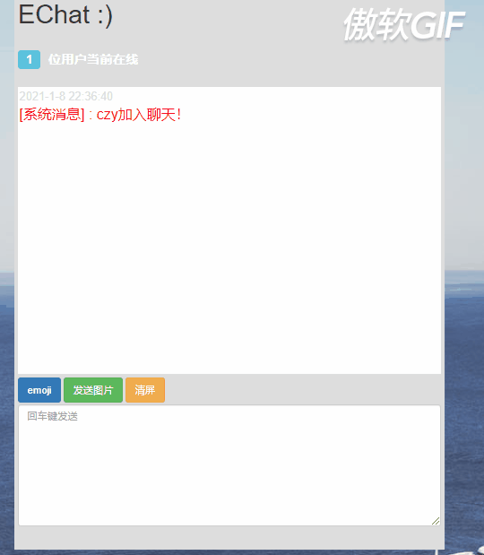

# Echat-SpringBoot
一款轻量级的基于SpringBoot + WebSocket的在线聊天室项目，在MccreeFei的聊天室基础上，将其升级为SpringBoot版本，去掉了JSP文件，去掉了xml编写的sql语句，使用thymeleaf以及注解的形式，更便于维护和使用。

# 项目展示

# 使用
下载并安装mysql 8.x，执行sql文件，在yml中配置数据库信息，启动项目即可使用。启动后访问本地8080端口即可，如果有SSL证书需求请自行配置。

# 演示地址
如果服务器运行良好的话，应该就能用:> https://hgshequ.cn/ (最新:由于没有过多项目部署需求，就没续费服务器了，望见谅)
